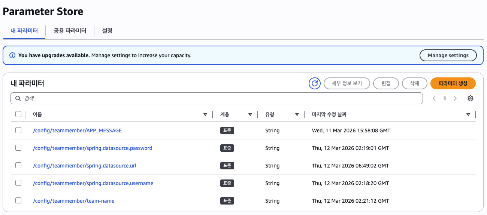
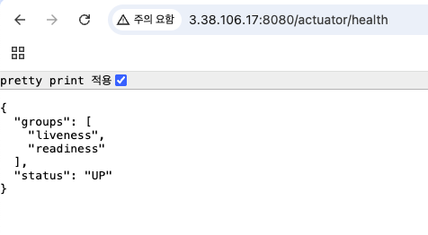
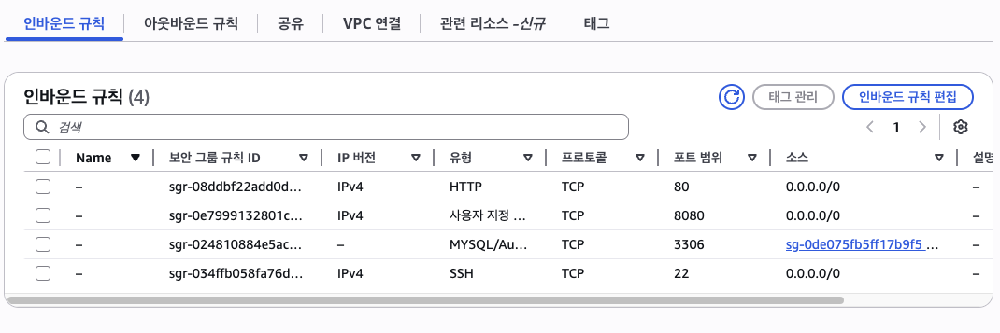
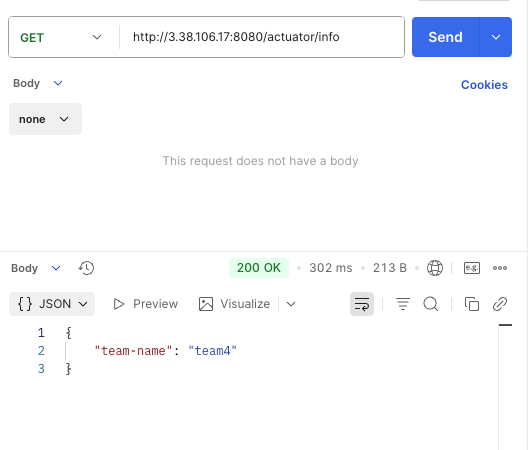
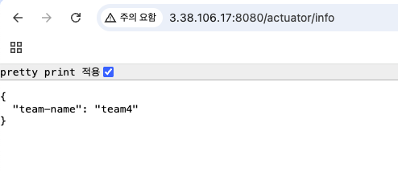
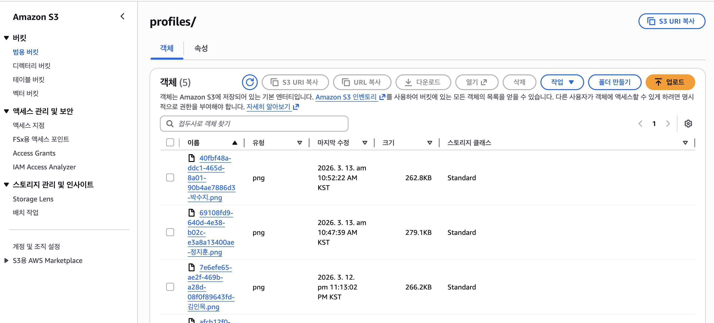
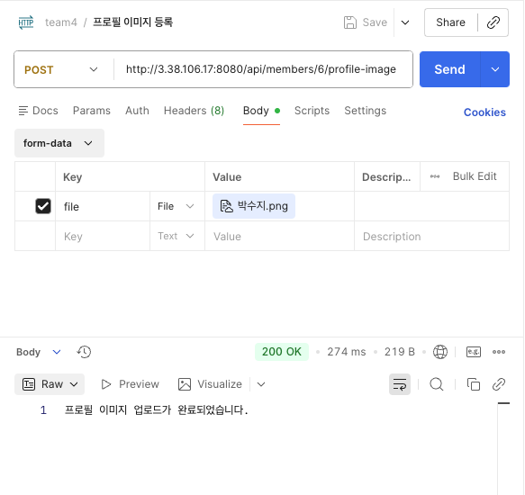
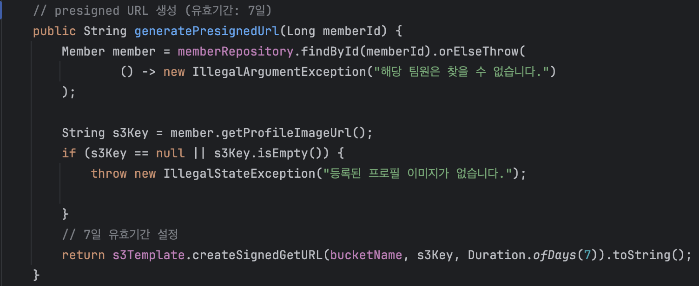
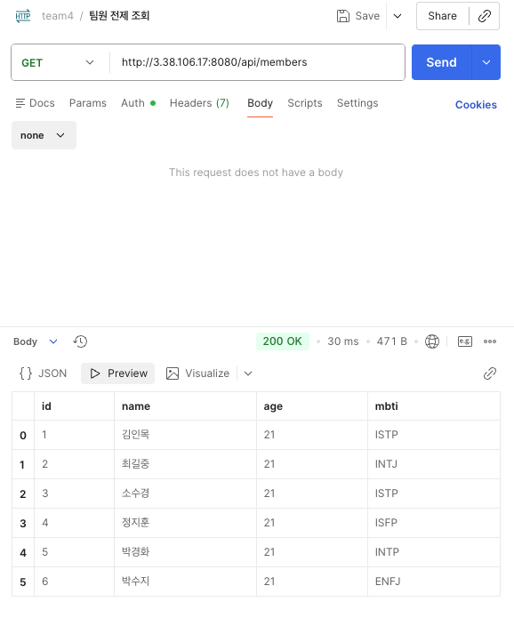

### 🛡️ LV 0: AWS Budget 설정 완료
실수로 인한 고가의 리소스 비용 발생을 방지하기 위해 예산 알림을 설정했습니다.

* **월 예산**: $100.00
* **알림 임계값**: 예산의 80% ($80.00) 도달 시
* **알림 유형**: 실제 비용(Actual) 기준 이메일 알림

**[설정 증빙]** 

---

## 🌐 LV 1: 네트워크 구축 및 핵심 기능 배포
안전한 VPC 환경을 설계하고, 팀원 관리 API와 상태 모니터링(Actuator) 기능이 포함된 애플리케이션을 EC2에 성공적으로 배포했습니다.

### 1️⃣ 인프라 구축 (VPC & EC2)
* **VPC 설계**: Public Subnet과 Private Subnet을 분리하여 보안성을 강화한 네트워크 환경을 구축했습니다.
* **EC2 생성**: 외부 접속이 가능한 Public Subnet에 EC2 인스턴스를 생성하고 탄력적 IP를 연결했습니다.

### 2️⃣ 애플리케이션 개발 및 운영 전략
* **팀원 관리 API 구현**:
  * `POST /api/members`: 이름, 나이, MBTI 정보를 JSON으로 받아 저장
  * `GET /api/members/{id}`: 저장된 팀원 상세 정보 조회
  * `GET /api/members`: 저장된 팀원 전체 정보 조회
* **Profile 분리**: `application-local.yml`(H2)과 `application-prod.yml`(MySQL)로 환경을 분리하여 운영 안정성을 확보했습니다.
* **로그 전략**:
  * API 요청 시 `[API - LOG]` 포맷의 INFO 로그 기록
  * 예외 발생 시 ERROR 레벨의 스택트레이스 기록으로 트러블슈팅 구조 마련

### 3️⃣ 상태 모니터링 (Actuator)
* `spring-boot-starter-actuator` 의존성을 추가하고, 헬스 체크 엔드포인트를 노출하도록 설정했습니다.
* **설정값**: `management.endpoints.web.exposure.include=health`

### 4️⃣ 배포 검증 및 결과
* **배포 서버 퍼블릭 IP**: `3.38.106.17`
* **Health Check 확인**: 외부 브라우저에서 서버 상태가 `UP`임을 확인했습니다.

**[EC2 배포 확인 결과]** 

> **확인 주소**: [http://3.38.106.17:8080/actuator/health](http://3.38.106.17:8080/actuator/health)
> **응답 결과**: `{"status": "UP"}`
---

## 🔐 LV 2: DB 분리 및 보안 연결 (Parameter Store & Security Group Chaining)
애플리케이션의 보안성을 극대화하기 위해 하드코딩된 설정값을 제거하고, 인프라 간 직접적인 신뢰 관계(Security Group Chaining)를 구축했습니다.

### 1️⃣ 데이터베이스(RDS) 구축 및 보안 체이닝
* **RDS MySQL 구축**: 로컬 테스트 및 운영을 위해 AWS RDS(MySQL 8.0)를 생성했습니다.
* **보안 그룹 체이닝 (핵심)**:
  * RDS의 인바운드 규칙에서 불특정 다수(`0.0.0.0/0`)의 접속을 차단했습니다.
  * **소스(Source)** 항목에 Step 1에서 생성한 **EC2의 보안 그룹 ID(`sg-0de075fb5ff17b9f5`)**를 등록하여, 오직 인증된 EC2 서버를 통해서만 DB 접근이 가능하도록 설계했습니다.

**[RDS 보안 그룹 설정 증빙]** 

### 2️⃣ AWS Systems Manager (Parameter Store) 활용
* **민감 정보 관리**: DB 접속 정보(URL, Username, Password) 및 팀 이름을 코드에 노출하지 않고 AWS 클라우드 내부에 안전하게 관리했습니다.
* **계층 구조 설계**: `/config/teammember/` 경로를 사용하여 애플리케이션별 설정을 체계화했습니다.

**[Parameter Store 설정 리스트]** 

### 3️⃣ 애플리케이션 요구사항 구현 및 검증
* **Dynamic Property 주입**: `spring-cloud-aws-starter-parameter-store` 의존성을 활용해 런타임에 설정값을 주입받아 동작하도록 구현했습니다.
* **Actuator Info 확장**: Parameter Store에 저장된 `team-name`을 `/actuator/info` 엔드포인트에서 확인할 수 있도록 커스텀 설정을 적용했습니다.

### 4️⃣ 최종 배포 및 검증 결과
* **Actuator Info 엔드포인트**: [http://3.38.106.17:8080/actuator/info](http://3.38.106.17:8080/actuator/info)
* **결과**: 외부 브라우저 및 Postman에서 Parameter Store에 저장한 `"team4"` 값이 정상적으로 응답됨을 확인했습니다.

**[Postman 검증 화면]** 

**[브라우저 최종 확인 결과]** 

## 🖼️ **LV 3: S3 프로필 이미지 업로드 및 보안 강화 (IAM Role)**
서버의 확장성과 데이터 무결성을 위해 프로필 이미지를 외부 스토리지인 **AWS S3**에 저장하고, **IAM Role**을 활용하여 자격 증명 노출 없이 **안전한 접근 권한**을 관리합니다.

---

### **1️⃣ S3 버킷 구축 및 보안 설정**
* **S3 버킷 생성**: `camp-health-suji-files` 버킷을 생성하고, 보안을 위해 **'모든 퍼블릭 액세스 차단'** 설정을 활성화했습니다.
* **IAM Role 기반 권한 관리**: `Access Key`를 코드에 하드코딩하지 않고, S3 및 SSM 접근 권한이 포함된 **IAM Role**을 생성하여 **EC2 인스턴스에 연결(Instance Profile)**했습니다.

**[S3 버킷 내 객체 저장 리스트]** 

---

### **2️⃣ API 요구사항 구현 및 검증**
* **프로필 이미지 등록 (`POST`)**: `MultipartFile`로 이미지를 받아 S3 버킷의 `profiles/` 경로에 업로드하며, 업로드 성공 시 확인 메시지를 반환합니다.
* **Presigned URL 반환 (`GET`)**: 보안상 S3 객체를 비공개로 유지하기 위해, 유효기간이 적용된 **임시 접근 URL(Presigned URL)**을 생성하여 클라이언트에 제공합니다.

**[Postman 업로드 성공 화면]** 

---

### **3️⃣ Presigned URL 유효기간 및 코드 구현**
* **유효기간 설정**: 과제 요구사항에 따라 채점 시 접근이 가능하도록 **유효기간을 7일(168시간)**로 설정했습니다.
* **구현 로직**: `s3Template`을 활용하여 **7일의 `Duration`**을 가진 Get URL을 생성합니다.

**[코드 구현 증빙 (유효기간 7일)]** 

---

### **4️⃣ 최종 접근 확인 결과**
* **검증 방법**: 서버에서 발급받은 Presigned URL을 외부 브라우저에 입력하여 이미지 접근 여부를 확인했습니다.
* **결과**: IAM Role 권한을 통해 생성된 임시 URL로 S3에 저장된 **박수지 팀원의 프로필 이미지**가 정상적으로 출력됨을 확인했습니다.

**[브라우저 실제 이미지 출력 결과]** 

---

### **5️⃣ 팀원 등록 데이터 최종 검증 (전체 목록 조회)**
* **검증 내용**: S3 이미지 업로드 후, `GET /api/members` 엔드포인트를 통해 전체 팀원 목록이 정상적으로 조회되는지 확인했습니다.
* **시각화 확인**: Postman의 **Visualize** 기능을 활용하여, 데이터베이스에 저장된 6명의 팀원 정보(ID, Name, Age, MBTI)가 표 형태로 정확히 출력됨을 검증했습니다.

**[Postman 팀원 전체 조회 결과]** 

> **확인 주소**: [http://3.38.106.17:8080/api/members](http://3.38.106.17:8080/api/members)

---

## 📝 **Project Retrospective (회고)**

### **1. 기술적 도전과 해결 (Achievements)**
* **실전 트러블슈팅 경험**: 배포 과정에서 발생한 `UnknownHostException`을 해결하며 스프링 부트 설정 주입의 우선순위를 체득하고, EC2와 RDS 엔드포인트 간의 물리적/논리적 연결 구조를 명확히 이해했습니다.
* **보안 의식 고취**: IAM Role과 Parameter Store를 활용해 민감 정보를 보호하는 실무적인 인프라 설계 방식을 경험했습니다.

### **2. 아쉬운 점 및 향후 과제 (Lessons Learned)**
* **에러 로그 분석의 중요성**: 초기에는 당황하여 🤯 ➞ 🤬 하는 시간도 있었지만, 결국 로그 속에 답이 있다는 진리를 깨달았습니다. 향후에는 더 빠르게 원인을 파악하는 '디버깅 근육'을 키우고 싶습니다.
* **코드 가독성**: 기능 구현에 집중하느라 놓친 리팩토링을 진행하여, 유지보수가 쉬운 코드를 작성하는 연습을 이어갈 예정입니다.

### **3. 마무리하며**
* "0"에서 시작한 도전이었지만, 하나씩 문제를 해결하며 동작하는 서버를 구축했을 때의 성취감은 무엇과도 바꿀 수 없는 경험이었습니다. 꼼꼼한 문서화 습관을 유지하며 더 견고한 백엔드 개발자로 성장하겠습니다.